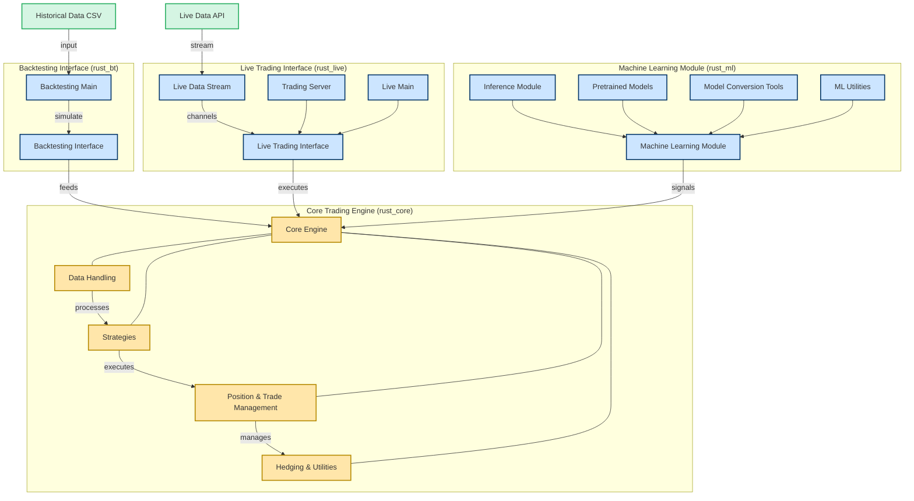

# rust_bt 🦀

A high performance, low-latency backtesting engine for testing quantitative trading strategies in Rust. The engine is designed to be used in conjunction with a strategy that implements the `Strategy` trait. The strategy is responsible for making trading decisions based on the `Broker` struct. For backtesting on historical data OHLC data is required, and for live trading bid/ask data is required.

It's barebones by design, and is intended to be expanded upon to align with the relevant market microstructure and fit the type of products you intend to trade.  

## Overview

- High performance, low-latency 
- Flexible, modular design
- Complete backtesting and live testing engine 
- Market microstructure simulation, including bid-ask spread, slippage, commissions, etc.
- Detailed trade and position management, fractional orders
- Contingent orders (SL/TP)
- Margin and leverage management for complex instruments
- Pairs trading, trading multiple instruments
- Plotting and statistics


## Components

- **rust_core**: The central trading engine  
  - Implements the core trading logic for backtesting and live trading
  - Houses strategies, orderbook logic, and data handling
  - Handles position management, margin and leverage


- **rust_live**: The live trading interface  
  - Connects the core trading logic to real-time data and execution
  - Handles live data streaming 
  - To run the live trading engine, navigate to the `rust_live` directory and run `cargo run`

- **rust_bt**: The backtesting interface  
  - Connects the core trading logic to historical data and starts the backtest
  - To run the backtest, navigate to the `rust_bt` directory and run `cargo run`


- **rust_ml**: The machine learning interface  
  - Loads models and runs inference on live and historical data
  - Tools for converting scalers and pytorch models to rust


### How It Works

the strategies are implemented in **rust_core**, but they are adapted to suit different operational environments:

- **Backtesting Strategies**  
  backtesting strategies use the standard engine types such as `Broker`, `OhlcData`, `Order`, and `Strategy`.
  these types are designed to work with preloaded historical market data, allowing the simulation of trades over past time periods. the backtesting engine in **rust_bt** orchestrates the process, ensuring that trades are simulated in a controlled, time-sequential manner.

- **Live Trading Strategies**  
  live strategies are implemented with dedicated live engine types like `LiveBroker`, `LiveData`, `Order`, and `LiveStrategy`.  
  These types are specifically designed to handle streaming market data and execute orders as market conditions evolve, ensuring that order placement, execution, and statistics (like pnl) update in real time.

this design ensures that while the core trading logic remains consistent in **rust_core**, each operational mode (backtest or live) uses the appropriate interface to manage data, process orders, and update trade statistics optimally. 



## Backtesting 

Strategies are implemented by creating a new struct in `rust_core/src/strategies/` that implements the `Strategy` trait:

```rust
use crate::engine::{Broker, OhlcData, Order, Strategy};
pub struct MyStrategy;

impl Strategy for MyStrategy {
    fn init(&mut self, broker: &mut Broker, data: &OhlcData) {
        // initialization can precompute indicators, etc..
    }

    fn next(&mut self, broker: &mut Broker, index: usize) {
        // implement the strategy logic here
    }
}
```

### Opening a position
The `Broker` struct provides the following core functionality:

- `new_order(order: Order)`: Places a new order
- `closed_trades(trade: Trade)`: Closes a trade
- `close_all_trades()`: Closes all trades
- `cash += closed_trade.pnl()`: Updates the cash balance

Orders are processed on every tick, and the `next` method is called on every tick.

To create a buy order we need to specify the size, and optionally the stop loss, take profit, limit, parent trade and instrument (to trade multiple instruments, default is 1).

```rust
let order = Order {
    size: trade.size,
    sl: None,
    tp: None,
    limit: None,
    stop: None,
    parent_trade: None,
    instrument: 1,
};
broker.new_order(order);
self.positions.register_position(trade.size); // track order with PositionManager (optional)
```
### PositionManager
The `PositionManager` provides a simple interface for handling all types of positions:

```rust
use crate::position::PositionManager;
let mut positions = PositionManager::new(3); // allow max 3 positions per side (Long and Short)
positions.register_position(trade.size); // register a long position
positions.register_position(-trade.size); // register a short position
positions.close_position(trade.size); // register closing a long position
positions.close_position(-trade.size); // register closing a short position
```
The `PositionManager` doesnt open or close positions, it simply tracks them in parallel for more granular control. This allows for more complex order management, which then enables us to implement more sophisticated hedging techniques in real-time. 

### Closing a position
To close a position we use the `Trade` struct. After closing each trade we need to update the cash balance and add the trade to the closed trades vector - alongside with updating the position manager if used:

```rust
let trade = broker.trades.remove(0); //closes first position in trades vector
let closed_trade = Trade {
    size: trade.size,
    entry_price: trade.entry_price,
    entry_index: trade.entry_index,
    exit_price: Some(price),
    exit_index: Some(index),
    sl_order: trade.sl_order,
    tp_order: trade.tp_order,
    instrument: trade.instrument,
};
broker.cash += closed_trade.pnl();
broker.closed_trades.push(closed_trade);
self.positions.close_position(trade.size);
```

To close all positions we need to delete each element in the `trades` vector and update our stats accordingly. We do this by calling the `close_all_trades` method from the `Broker` struct.

### Plotting

The `backtest.plot()` function is used to plot the equity curve. It takes a slice of (naivedatetime, equity_value) tuples and an output file path.

```rust
if let Err(e) = backtest.plot("output_equity_plot.png") {
    eprintln!("error generating plot: {}", e);
}
```

## Live Trading 

Strategies are implemented in the same way as for backtesting, but the `next` method is called on every tick of the live data, where every 'tick' is a data event. Here we use the LiveStrategy trait:

```rust
use crate::live_engine::{LiveBroker, LiveData, Order, LiveStrategy};
pub struct MyStrategy;

impl LiveStrategy for MyLiveStrategy {
    fn init(&mut self, broker: &mut LiveBroker, data: &LiveData) {
        // Nothing to do here when trading live
    }

    fn next(&mut self, broker: &mut LiveBroker, index: usize) {
        // implement the live strategy logic here
    }
}
```

### Streaming

The live engine is designed to handle streaming data from a live data source. The `LiveData` struct is used to store the live data, and the `LiveBroker` struct is used to process the live data. Our backend is currently setup to receive data from Saxo Bank's SaxoOpenAPI, but this can be easily extended to other data sources by modifying `rust_live/src/stream.rs`. To run as is, you need developer access to the SaxoOpenAPI and an API token. 

The LiveData struct is made for CFD trading, so it only contains the `ask` and `bid` prices. If you want to trade other asset classes, you need to create a new data struct to include the relevant data.

```rust
pub struct LiveData {
    pub instrument: Vec<String>,
    pub date: Vec<String>,
    pub ask: Vec<f64>,
    pub bid: Vec<f64>,
}
```


